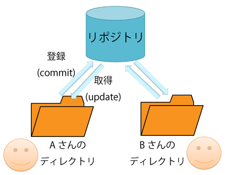
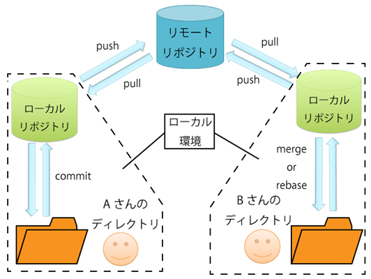

# How to Git

GitとはSubversionと同じようにバージョン管理をおこなうためのソフトです

### GitとSubversionとの違い

これまでの講義や演習では、Subversionを利用してきたと思いますが、主な違いは、Subversionは集中型バージョン管理システム、Gitは分散型バージョン管理システムというところです。これらの違いは以下の通りです

#### 集中型バージョン管理システム(Subversion)

集中型バージョン管理システムは、サーバー上にあるリポジトリにコミットする必要があります。これまで使ってきたときは、コミットするとそのままサーバー上にコミットした内容が送られていました。そして他のメンバーが変更した内容を更新することで取り入れてました。なので、操作は単純ですが、コミットするには細心の注意が必要です。

#### 分散型バージョン管理システム(Git)
一方分散型リポジトリは、***ローカルリポジトリ***・***リモートリポジトリ***という二つのリポジトリが存在します。これらの違いは、集中型リポジトリの場合、リポジトリを置いているサーバに問題が発生すればコミットできなくなりますが、分散型リポジトリの場合は、サーバに問題が発生しても、手元のローカルリポジトリがあるため問題なくコミットできます。ロカールリポジトリでの操作はリモートリポジトリに影響を与えないので，気軽にコミットできるのが主な利点です。

何を書くか
git clone git commit
git branch checkout
git push fetch pull
git merge